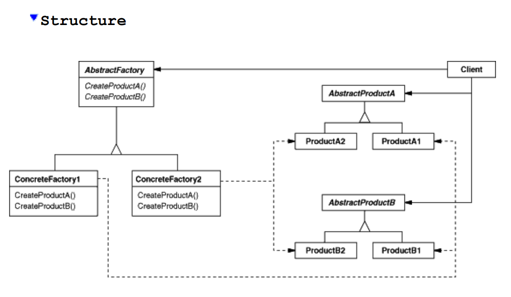
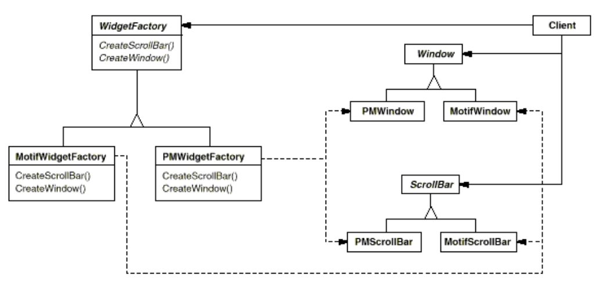

# Abstract Factory

* Provide an interface for creating families of related or dependent objects without specifying their concrete classes.

### Structure

### Example

### Participants
* AbstractFactory
* Concrete Factories
* Concrete Product

### When To Use
- A system should be independent of how its products are created, composed, and represented.
- A system should be configured with one of multiple families of products.
- A family of related product objects is designed to be used together, and you need to enforce this constraint.
- You want to provide a class library of products, and you want to reveal just their interfaces, not their implementations.

### Pros and Cons
* Isolates concrete classes
* Promotes consistency among concrete products
