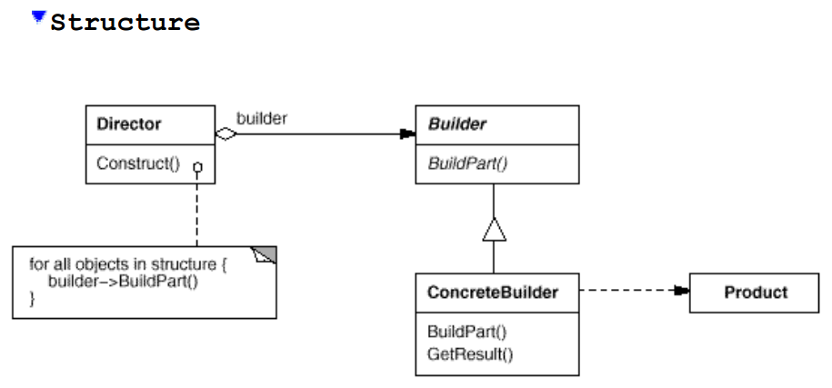
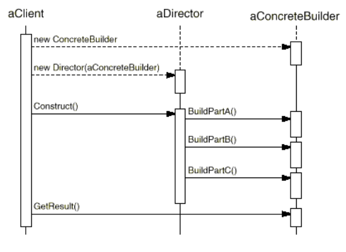

# Builder

* Separate the construction of a complex object from its representation so that the same construction process can create different representations.

### Structure

### System example

### When To Use
* A system should be independent of how its products are created, composed and represented
* A system should be configured with one of multiple families of products
* A family of related product objects is designed to be used together and you need to enforce this constraint

### Pros
* Finer control over construction process
* Isolates complexities of construction away from client that doesn't care

### Cons
* Create new builder or update a builder when a products internal representation changes
