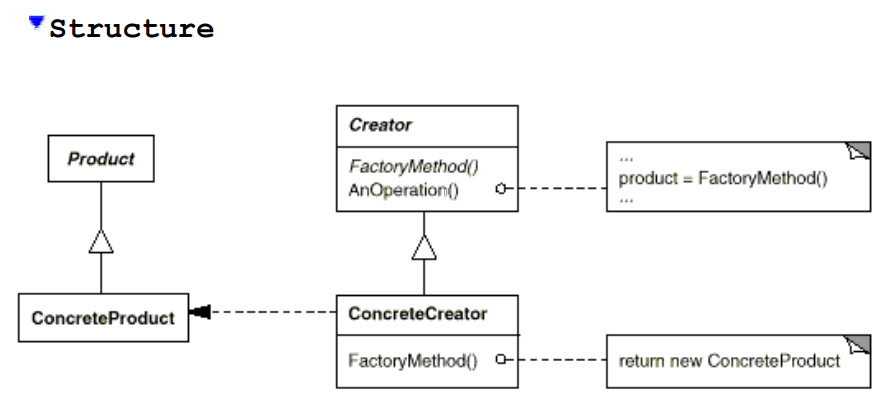
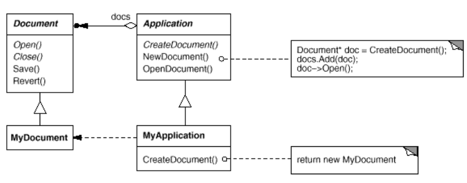

# Factory Method (aka Virtual Constructor)
* Define an interface for creating an object, but let subclasses decide which class to instantiate. Factory Method lets class defer instantiation to subclasses.

### Structure

### Example

### When To Use
* A class can't anticipate the class of objects it must create
* A class wants its subclasses to specify the objects it creates
* Classes delegate responsibility to one of several helper subclasses, and you want to localize the knowledge of which helper subclass is the delegate

### Pros

### Cons
